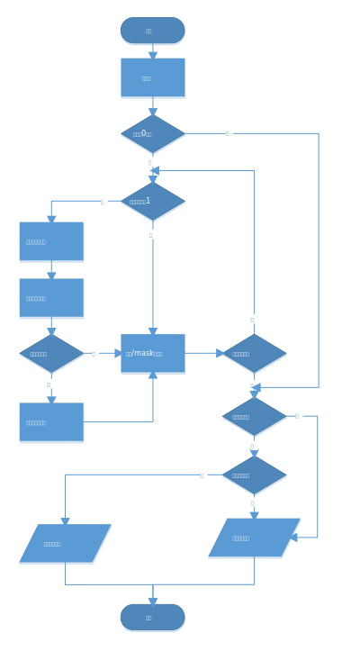

# Unsigned Multiplication using RV32I ISA
This is a multiplication function using RV32I assembly language.

## Algorithm Theory
### shift accumulator
In RV32I, only 32 32bits reg files can be used. To implement mul operation through software, we must use two registers to store for the results.

For every bit of the multiplicand, logic shift left the multiplier and accumulate it if it is 1. The overall structure of the mul is shown in the folllowing fig.

Two accumulators are used to compute the result. The differences between lower bits and uppper bits are the shift times.

### carry out
The final problem is the carry out from lower bits accumulator. So if there is a carry out from it, another selfadd need to be done for higher bits accumulator.

CARRY OUT signal is obtained by the following equation:
$$ CARRY OUT = Reg.D < num2 $$

## Program Flow
The program flow chart is shown in below:

