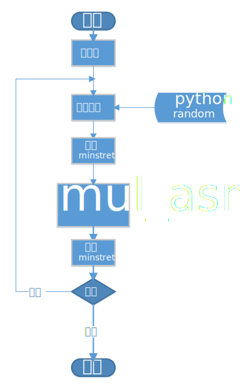

# 测试手册

## 测试原理
使用随机数作为无符号的被乘数和乘数，然后导入汇编乘法函数中进行测试，倘若计算错误，则会终止当前仿真。

## 测试操作步骤
1. 进入Makefile 修改$(TESTTIME)变量，代表进行随机测试的次数。
2. 使用命令`make all -i`即可开始测试

## 实现原理
1. 在Makefile中的TESTTIME变量会传入python脚本中。
2. 使用python3的random库产生随机数，并将其写入config.h文件中。
3. main.c会根据config.h中的配置顺序读取数组中的数据并调用汇编乘法进行运算与正确性检验。
